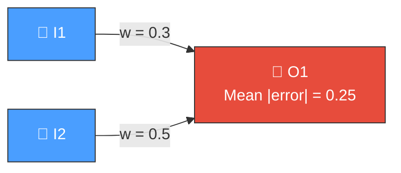
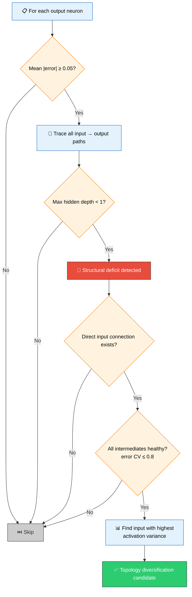
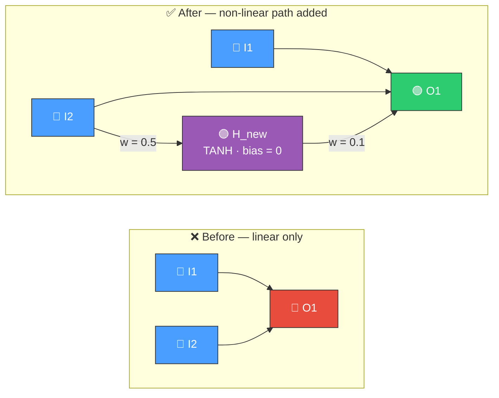
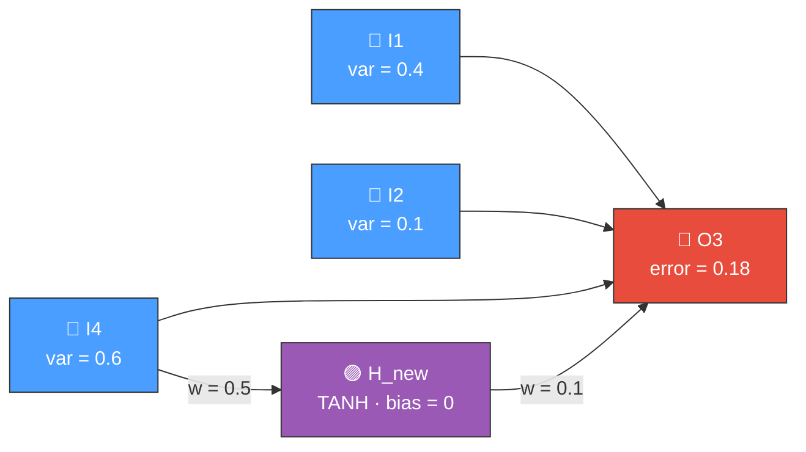

# 🌿 Topology Diversification

[Back to Discovery Index](README.md) | **Source:** [`src/analysis/detection/topology_diversification.rs`](../../src/analysis/detection/topology_diversification.rs) | **Issue:** [#549](https://github.com/stSoftwareAU/NEAT-AI-Discovery/issues/549)

---

## 🔍 The Problem

Some output neurons have high error but every path from input to output is
**direct** — there are no hidden neurons providing intermediate processing.
This means the output can only compute a linear combination of inputs, which
is insufficient when the problem requires non-linear transformations.

> **🧮 Linear limitation:**
> `O1 = w1 × I1 + w2 × I2 + bias`
>
> But the target function is non-linear:
> `target ≈ I1 × I2 + sin(I1)` — needs intermediate computation.

### ⚠️ Why It Hurts the Creature's Score

> [!WARNING]
> Without hidden neurons the output is restricted to **linear functions** of its inputs. No amount of weight optimisation can overcome an architectural deficit.

- **Limited expressiveness**: Without hidden neurons, the output can only
  represent linear functions of its inputs.
- **Structural deficit**: Weight tuning alone cannot learn non-linear
  relationships — the problem is architectural, not parametric.
- **High persistent error**: The error remains high regardless of weight
  optimisation because the needed computation is missing.

---

## 🔬 How We Detect It

### 🤔 Why Not Just Weight Tuning?

> [!NOTE]
> The module checks that the problem is **structural** (lack of non-linearity) rather than **parametric** (bad weights). If existing hidden neurons on the path have a high error coefficient of variation (> 0.8), the issue is likely parametric and this module skips the output.

---

## 🛠️ How We Fix It

The fix adds a new hidden neuron with TANH activation between the best
input and the output, introducing non-linear processing capability.

### 🔀 Before vs After

| Candidate | Operations | Detail |
|-----------|-----------|--------|
| **Add hidden neuron** | `addNeuron` + `addSynapse` (input → new) + `addSynapse` (new → output) | 3-operation coordinated candidate |

> [!TIP]
> The input with the **highest activation variance** is chosen as the source, as it has the most potential to benefit from non-linear transformation.

**Estimated improvement:** `mean_output_error × depth_deficit × 0.15`

---

## 📝 Example

> **Output neuron O3:** TANH, mean |error| = 0.18
> **Direct inputs:** I1 (variance = 0.4), I2 (variance = 0.1), I4 (variance = 0.6)
> **Max hidden depth** on any I → O3 path: **0** (no hidden neurons)

> **🏆 Best input source:** I4 (highest variance = 0.6)
>
> **Candidate (3 operations):**
> 1. Add neuron `H_new` (TANH, bias = 0.0, UUID via FNV-1a hash)
> 2. Add synapse `I4 → H_new` (weight = 0.5)
> 3. Add synapse `H_new → O3` (weight = 0.1)
>
> **Estimated improvement:** 0.18 × 1.0 × 0.15 = **0.027**
>
> After fix: O3 now has a non-linear intermediate computation
> that can learn patterns weight tuning alone could not capture.

---

## 📚 References

- **Source module**: [`src/analysis/detection/topology_diversification.rs`](../../src/analysis/detection/topology_diversification.rs)
- **DISCOVERY_TYPES.md**: [Technical reference](../DISCOVERY_TYPES.md)
- **Related**: [Skip Connection](skip-connection.md) — adds shortcuts in
  deep networks (complementary: adds depth where it's missing)
- **Related**: [Add Neuron](add-neuron.md) — general hidden neuron addition
- **Related**: [Bottleneck Neuron](bottleneck-neuron.md) — adds parallel
  capacity at information jams
