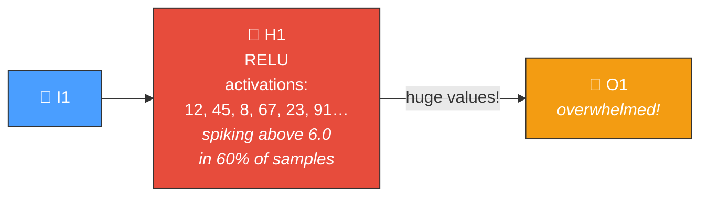
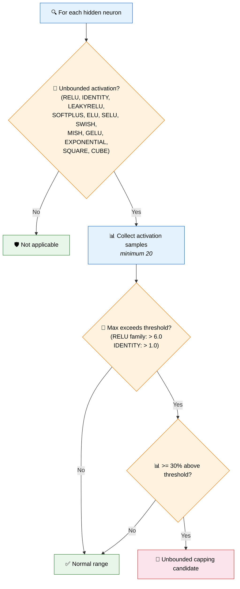
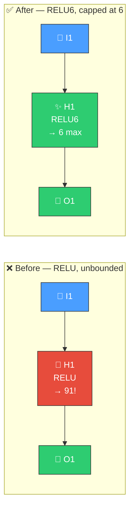

# 🚀 Unbounded Capping Detection

[Back to Discovery Index](README.md) | **Source:** [`src/analysis/detection/unbounded_capping.rs`](../../src/analysis/detection/unbounded_capping.rs) | **Issue:** [#441](https://github.com/stSoftwareAU/NEAT-AI-Discovery/issues/441)

---

## 🔍 The Problem

Neurons with **unbounded activation functions** (RELU, IDENTITY, LEAKYRELU,
etc.) can produce arbitrarily large outputs. When these neurons consistently
"spike" — producing high activations across many training samples — they
inject disproportionate signal magnitudes into the network, overwhelming
downstream neurons and introducing noise.

> 🚀 **Spiking out of control!** Unbounded activations push massive values into downstream neurons, drowning out other signals.

### ⚠️ Why It Hurts the Creature's Score

- **Downstream saturation**: Large values push receiving neurons into
  saturation, reducing their discrimination ability.
- **Noise amplification**: Extreme activations amplify noise, making
  predictions brittle and variable.
- **Weight scaling issues**: Other synapses' contributions are dwarfed
  by the spiking neuron's oversized signal.

---

## 🔬 How We Detect It

The 30% threshold ensures we only flag consistent spiking, not occasional
outliers.

---

## 🛠️ How We Fix It

The fix replaces the unbounded activation with a bounded version that caps
extreme values while preserving the function's character in the normal range:

| Current Squash | Recommended | Rationale |
|---------------|-------------|-----------|
| RELU, LEAKYRELU, ELU, SELU, GELU, SWISH, MISH, SOFTPLUS | RELU6 | Caps at 6.0, preserves zero-threshold behaviour |
| IDENTITY (positive mean) | RELU6 | Caps positive spikes |
| IDENTITY (negative mean) | HARD_TANH | Caps both directions at ±1 |
| EXPONENTIAL | SOFTPLUS | Smooth, bounded-growth alternative |
| SQUARE, CUBE | RELU6 | Prevents polynomial explosion |

| Candidate | Operation | Detail |
|-----------|-----------|--------|
| **Cap activation** | `changeSquash` | Switch to bounded version |

---

## 📝 Example

> A creature has 40 hidden neurons. Discovery finds:
>
> **Neuron H22:** RELU
>
> | Metric | Value |
> |--------|-------|
> | Max activation | 91.3 |
> | Fraction above 6.0 | 62% |
>
> → Consistently spiking, overwhelming downstream neurons
>
> **Fix:** Change RELU → RELU6
> → Activations capped at 6.0, downstream neurons receive manageable signal magnitudes,
> network stability improves ✅

---

## 📚 References

- **Source module**: [`src/analysis/detection/unbounded_capping.rs`](../../src/analysis/detection/unbounded_capping.rs)
- **DISCOVERY_TYPES.md**: [Unbounded Capping Detection](../DISCOVERY_TYPES.md#unbounded-capping-detection)
- **Related**: [Activation Mismatch](activation-mismatch.md) — detects
  structural mismatch between activation and data
- **Related**: [Saturated Neuron](saturated-neuron.md) — detects neurons
  stuck at activation bounds (the opposite problem)
