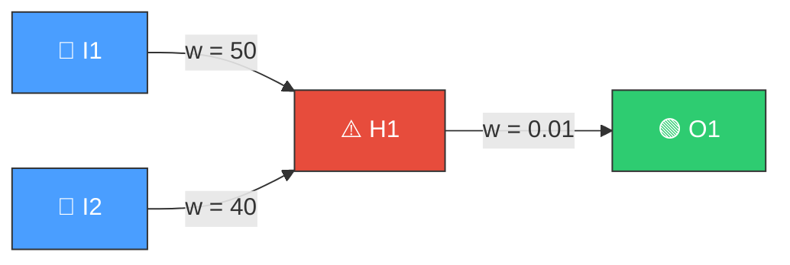
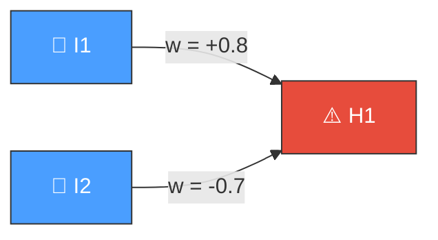
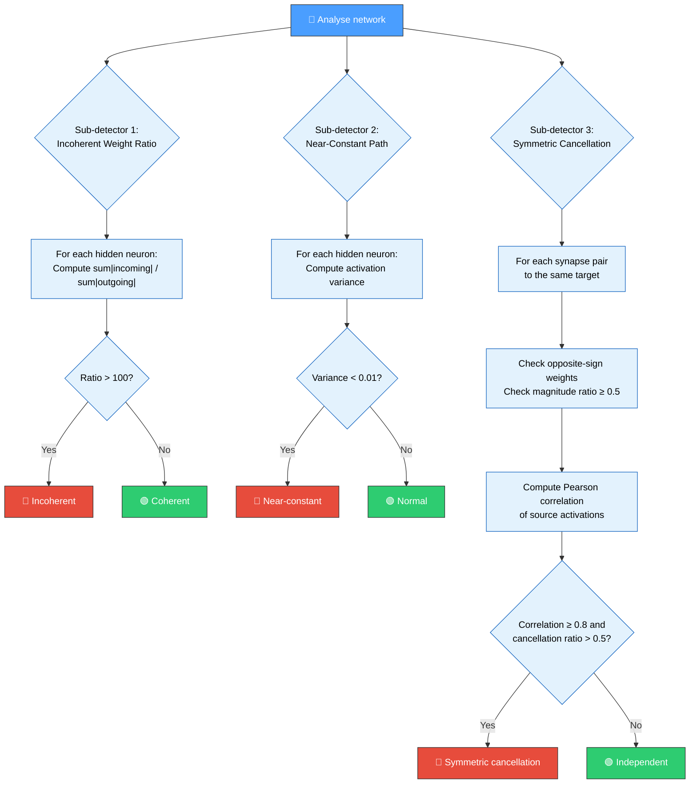
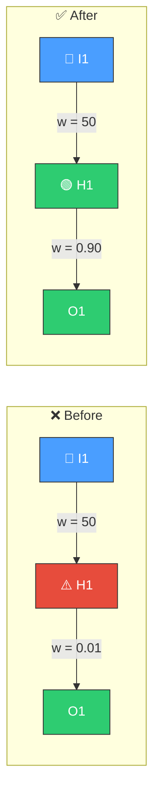
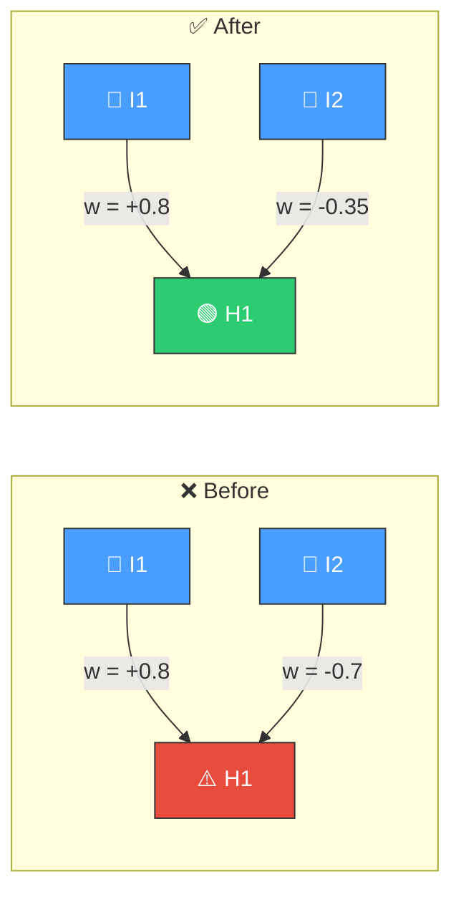

# ⚖️ Weight Coherence Validation

[Back to Discovery Index](README.md) | **Source:** [`src/analysis/detection/weight_coherence.rs`](../../src/analysis/detection/weight_coherence.rs) | **Issue:** [#437](https://github.com/stSoftwareAU/NEAT-AI-Discovery/issues/437)

---

## 🔍 The Problem

**Weight coherence** issues arise when synapse weights evolve into
configurations that are internally inconsistent or fragile. Three distinct
sub-patterns are detected:

> 💡 **Key insight:** These patterns waste network capacity — synapses and
> neurons exist but contribute little or nothing to the final output.

### ⚠️ 1. Incoherent Weight Ratio

A hidden neuron's total incoming weight magnitude vastly exceeds its outgoing
weight magnitude (ratio > 100:1). The neuron amplifies its input enormously
but then attenuates the result, wasting dynamic range and amplifying noise.

> 🔴 **Incoherent!** Incoming sum = 90, outgoing sum = 0.01, ratio = 9000:1.

### 📉 2. Near-Constant Path

A hidden neuron's activation variance is extremely low (< 0.01), meaning
it produces a near-constant output regardless of input. This is similar to
a dead neuron but the output is a non-zero constant rather than zero.

### 🔄 3. Symmetric Cancellation

Two inputs to the same target have opposite-sign weights with similar
magnitudes and highly correlated activations (correlation ≥ 0.8). They
cancel each other out, wasting two synapses to produce near-zero net effect.

> 🔴 **Cancellation!** Correlation(I1, I2) = 0.92. Net contribution ≈ 0 —
> two synapses, no signal!

---

## 🔬 How We Detect It

---

## 🛠️ How We Fix It

### 🔧 Incoherent Ratio Fix — Before & After

> ✅ **Fix:** Ratio reduced from 9000:1 to ≈ 100:1 by rescaling the outgoing weight.

### 🔧 Symmetric Cancellation Fix — Before & After

> ✅ **Fix:** Weaker weight halved from -0.7 to -0.35, reducing cancellation.

### 📋 Repair Operations

| Sub-detector | Candidate | Operation | Detail |
|-------------|-----------|-----------|--------|
| **Incoherent ratio** | Rescale outgoing | `setWeight` | Set outgoing weight to incoming_sum / 100 |
| **Near-constant** | Shift from saturation | `setBias` | Adjust bias to escape constant region |
| **Near-constant** | Reduce causing weight | `setWeight` | Reduce the dominant incoming weight by 90% |
| **Symmetric cancellation** | Reduce weaker | `setWeight` | Halve the smaller-magnitude weight |

---

## 📝 Example

> **Sub-detector 1 — Incoherent Ratio:**
> Neuron H5: incoming weights sum = 85.0, outgoing = 0.005.
> Ratio = 17000:1.
> **Fix:** Set outgoing weight to 85.0 / 100 = 0.85.

> **Sub-detector 2 — Near-Constant:**
> Neuron H12: activation variance = 0.002.
> Always outputs ≈ 0.73 regardless of input.
> **Fix:** Adjust bias to move operating point, or reduce dominant weight.

> **Sub-detector 3 — Symmetric Cancellation:**
> I3 (w = +0.6) → H8, I7 (w = -0.55) → H8.
> Correlation(I3, I7) = 0.88, cancellation ratio = 0.73.
> **Fix:** Reduce I7 → H8 weight from -0.55 to -0.275.

---

## 📚 References

- **Source module**: [`src/analysis/detection/weight_coherence.rs`](../../src/analysis/detection/weight_coherence.rs)
- **DISCOVERY_TYPES.md**: [Technical reference](../DISCOVERY_TYPES.md)
- **Related**: [Noise-to-Signal Ratio](noise-signal.md) — detects noisy
  synapses that amplify variance
- **Related**: [Dead Neuron](dead-neuron.md) — detects neurons with zero
  output (near-constant is a milder variant)
