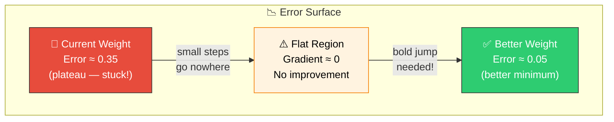
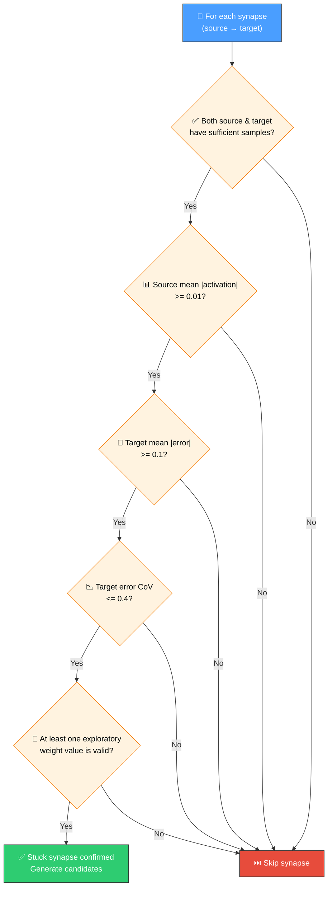
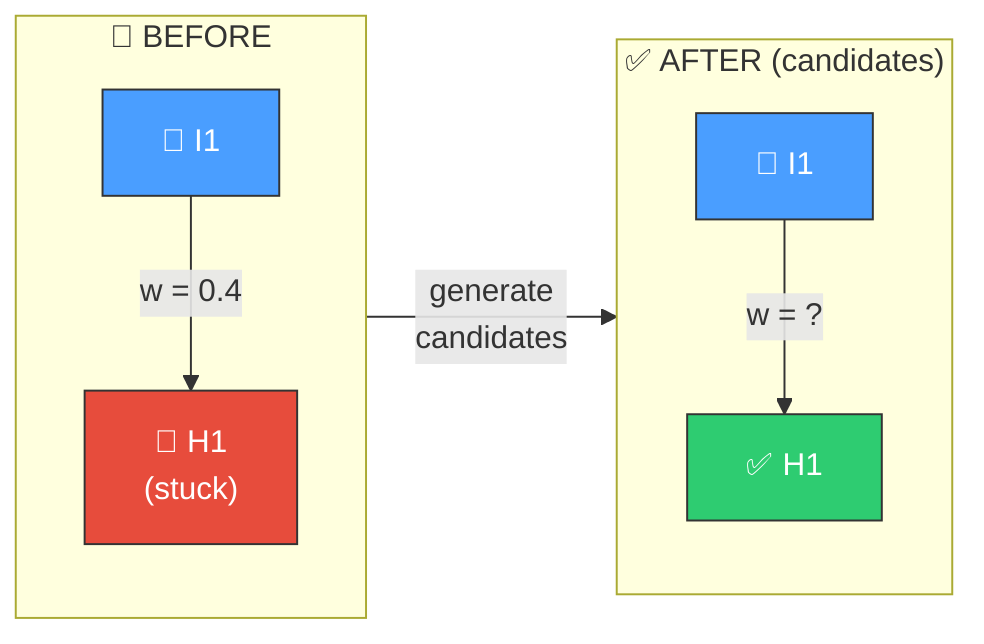
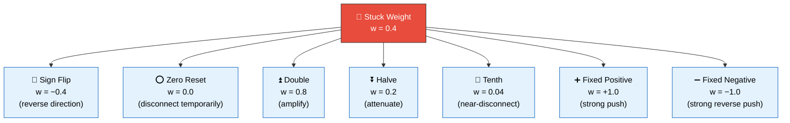

# 🔄 Weight Magnitude Reset

[Back to Discovery Index](README.md) | **Source:** [`src/analysis/detection/weight_magnitude_reset.rs`](../../src/analysis/detection/weight_magnitude_reset.rs) | **Issue:** [#550](https://github.com/stSoftwareAU/NEAT-AI-Discovery/issues/550)

---

## 🔍 The Problem

Some synapses feed target neurons that are **stuck in a plateau local
minimum** — the target has consistently high error that varies little across
samples. This flat error surface means gradient-based adjustments produce
no improvement; the synapse weight is trapped in a basin where small changes
have no effect.

The solution is to try **dramatically different weight values** — sign flips,
magnitude resets, and scaling — to escape the basin entirely.

> 💡 **Key insight:** When the error surface is flat, small gradient steps
> achieve nothing. A bold jump to a completely different weight value is the
> only way to escape the plateau.

### 📉 Error Surface (Conceptual)

### ⚠️ Why It Hurts the Creature's Score

- **Stuck at high error**: The target neuron consistently produces wrong
  outputs but small weight tweaks cannot fix it.
- **Wasted optimisation**: Gradient-based methods keep trying small steps
  that go nowhere, consuming discovery budget.
- **Plateau trap**: The error coefficient of variation is low (< 0.4),
  confirming the error is not random noise but a genuine stuck state.

> ⚠️ **Warning:** A plateau trap can silently waste the entire discovery
> budget on futile micro-adjustments while the creature's score stagnates.

---

## 🔬 How We Detect It

> 📝 **Note:** The coefficient of variation threshold (0.4) distinguishes
> a genuine plateau from noisy error. Low variation confirms the neuron is
> truly stuck, not just experiencing random fluctuations.

---

## 🛠️ How We Fix It

Multiple exploratory weight candidates are generated for each stuck synapse,
each representing a different escape strategy:

### 🔀 Before & After (Multiple Candidates)

### 🎯 Candidate Escape Strategies

| Candidate | Operation | Detail |
|-----------|-----------|--------|
| **Exploratory weight** | `setWeight` | Each dramatically different value is a separate candidate |

Each candidate's estimated improvement considers the plateau tightness,
error magnitude, and sensitivity factor:
`improvement = mean_error × plateau_tightness × sensitivity × 0.15`.

> 🔬 **How it works:** The system generates all seven candidates
> simultaneously. Each represents a fundamentally different escape direction,
> maximising the chance that at least one breaks free of the plateau.

---

## 📝 Example

> **Scenario:** A creature has a synapse **I3 → H7** with weight **0.35**.
>
> **Target H7 status:**
> - Mean |error| = 0.25 (stuck at high error)
> - Error std_dev = 0.08
> - Coefficient of variation = 0.32 (< 0.4 → plateau confirmed)
>
> **Source I3 status:**
> - Mean |activation| = 0.6 (actively contributing)
>
> **Candidates generated:**
>
> | # | Weight | Strategy | Improvement |
> |---|--------|----------|-------------|
> | 1 | w = −0.35 | Sign flip | ≈ 0.025 |
> | 2 | w = 0.0 | Zero reset | ≈ 0.020 |
> | 3 | w = 0.70 | Double | ≈ 0.018 |
> | 4 | w = 0.175 | Halve | ≈ 0.015 |
> | 5 | w = 0.035 | Tenth | ≈ 0.012 |
> | 6 | w = +1.0 | Fixed positive | ≈ 0.022 |
> | 7 | w = −1.0 | Fixed negative | ≈ 0.022 |
>
> NEAT-AI validates each candidate through ablation testing
> to find which escape direction actually improves the score.

---

## 📚 References

- **Source module**: [`src/analysis/detection/weight_magnitude_reset.rs`](../../src/analysis/detection/weight_magnitude_reset.rs)
- **DISCOVERY_TYPES.md**: [Technical reference](../DISCOVERY_TYPES.md)
- **Related**: [Gradient-Based Synapse Adjustment](gradient-discovery.md) —
  small gradient-descent weight changes (complementary approach)
- **Related**: [Error Plateau](error-plateau.md) — detects output neurons
  stuck at high error (similar concept, different fix)
