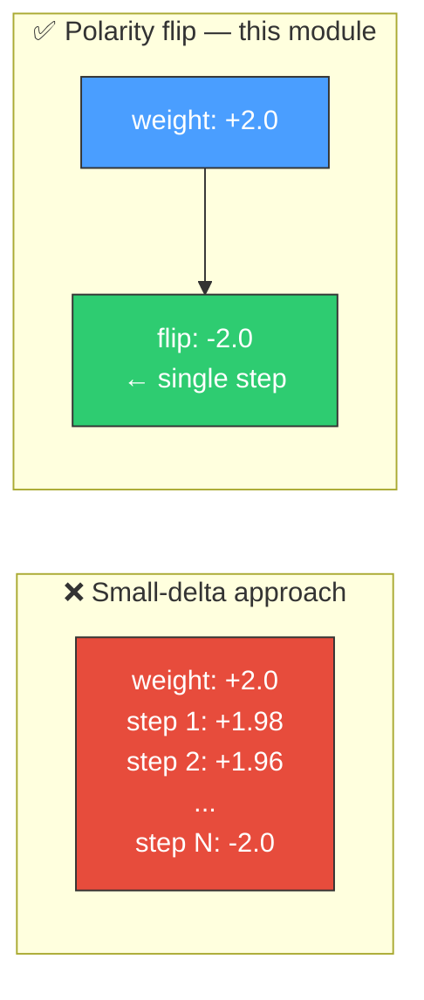
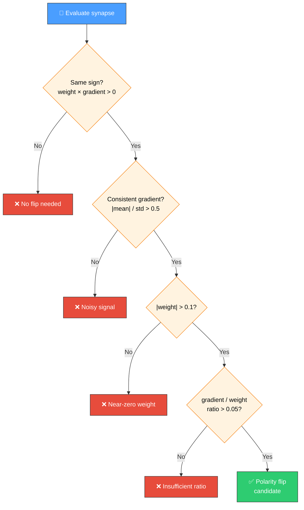
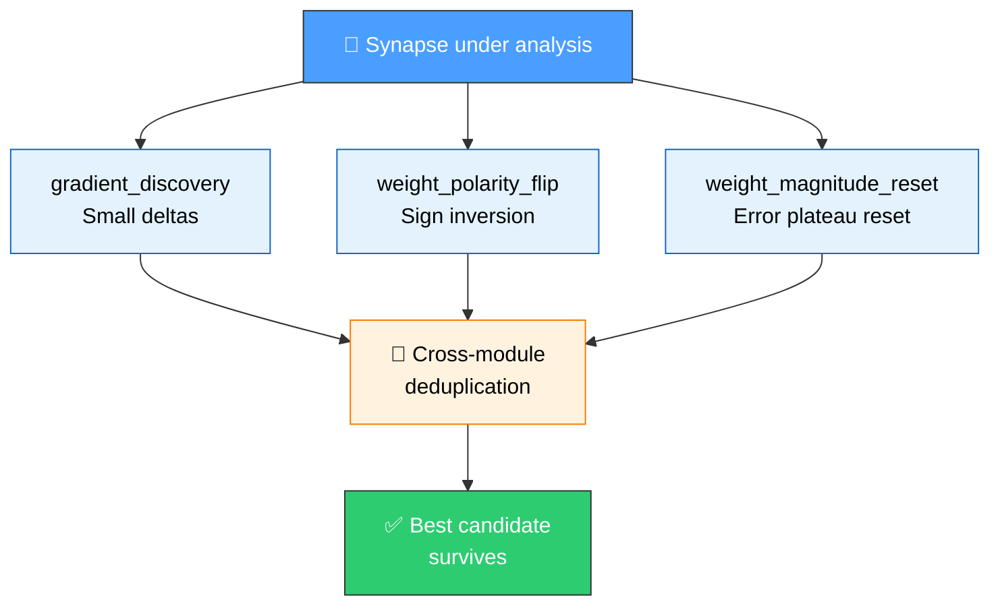

# 🔃 Synapse Weight Polarity Flip

[Back to Discovery Index](README.md) | **Source:** [`src/analysis/detection/weight_polarity_flip.rs`](../../src/analysis/detection/weight_polarity_flip.rs) | **Issue:** [#644](https://github.com/stSoftwareAU/NEAT-AI-Discovery/issues/644)

---

## 🔍 The Problem

When a synapse has weight +2.0 but the gradient consistently indicates the
weight should decrease (positive gradient → descent direction is negative),
many small delta steps are needed to cross zero and reach the optimal value
(e.g., -2.0). The existing `gradient_discovery` module proposes only small
delta adjustments, requiring many iterations to traverse through zero.

> ⚠️ **Performance bottleneck** — Crossing zero via incremental steps can
> require dozens of iterations, each consuming evaluation cycles that could
> be spent on other structural improvements.

### ⚡ Why It Matters

- **Faster convergence**: A single `setWeight` candidate replaces dozens of
  incremental gradient steps.
- **Structural jump**: Crosses the zero boundary directly rather than
  approaching it asymptotically.
- **Complementary to gradient discovery**: The polarity flip handles large
  sign inversions; gradient discovery handles fine-grained adjustments.

> 💡 **Key insight** — A polarity flip is a *structural* change, not a
> *tuning* change. It fundamentally reverses the role of a synapse in the
> network.

---

## 🔬 Detection Criteria

A synapse is a polarity flip candidate when:

1. **Sign agreement between weight and gradient**: The raw gradient
   (∂error/∂weight) has the same sign as the current weight. This means
   gradient descent (which moves in the −gradient direction) would push the
   weight through zero toward the opposite sign.

2. **High gradient consistency**: The ratio |mean gradient| / std_dev exceeds
   0.5, ensuring the gradient direction is reliable and not just noise. This
   threshold is higher than `gradient_discovery` (0.3) because a polarity
   flip is a larger structural change that requires stronger evidence.

3. **Significant weight magnitude**: The absolute weight exceeds 0.1, so
   flipping the sign represents a meaningful structural change.

4. **Gradient magnitude relative to weight**: The gradient-to-weight ratio
   exceeds 0.05, indicating that many small steps would be needed.

> 📏 **Threshold rationale** — The consistency threshold of 0.5 is
> deliberately stricter than `gradient_discovery` (0.3) because a polarity
> flip is a larger, harder-to-reverse structural change.

---

## 🛠️ Candidate Generation

For each detected synapse, the module produces a single `setWeight` coordinated
structural candidate with the negated weight value:

| Field | Value |
|-------|-------|
| **Operation** | `SetWeight` |
| **New weight** | `-current_weight` |
| **Expected improvement** | Proportional to gradient magnitude × weight change × consistency |

The candidate comment includes the gradient value, current weight, consistency
metric, and sample count for traceability.

---

## 🔗 Relationship to Other Modules

| Module | Scope | Overlap |
|--------|-------|---------|
| `gradient_discovery` | Small delta adjustments in gradient descent direction | No overlap — different weight values proposed |
| `weight_magnitude_reset` | Stuck synapses with high error plateau | May detect same synapse but uses different criteria (error plateau vs gradient direction) |

The cross-module deduplication pipeline ensures that if both modules propose
candidates for the same synapse, only the most promising candidate survives.

---

## 📝 Example Scenario

> **Creature topology:**
> `input-0 ──[weight: +2.0]──▶ output-0`
>
> **Observation data (30 samples):**
> - `input-0` activations: 0.1, 0.2, …, 3.0 (positive)
> - `output-0` errors: 0.05, 0.1, …, 1.5 (positive)
>
> **Gradient computation:**
> gradient ≈ mean(activation × error) = positive
> Weight is also positive → same sign
>
> **Detection:**
> - ✅ Weight magnitude |2.0| > 0.1
> - ✅ Gradient consistency |mean| / std > 0.5
> - ✅ Same sign → descent crosses zero
> - ✅ Gradient / weight ratio > 0.05
>
> **Candidate:**
> `setWeight(input-0, output-0, -2.0)`

---

## 🧪 Tests

See [`tests/issue_644_weight_polarity_flip.rs`](../../tests/issue_644_weight_polarity_flip.rs):

1. Detects positive weight + positive gradient (descent crosses zero)
2. Detects negative weight + negative gradient (descent crosses zero)
3. Rejects opposite-sign weight-gradient pairs (no flip needed)
4. Rejects inconsistent gradients (noisy signal)
5. Produces `setWeight` with negated weight
6. Rejects near-zero weights (no meaningful flip)
7. Handles edge cases (empty records, insufficient samples)
8. Candidates are distinct from gradient discovery small-delta proposals
9. Candidates sorted by estimated improvement

> ✅ **Coverage** — Tests verify both positive and negative detection paths,
> edge cases, and confirm that polarity flip candidates are distinct from
> `gradient_discovery` proposals.
