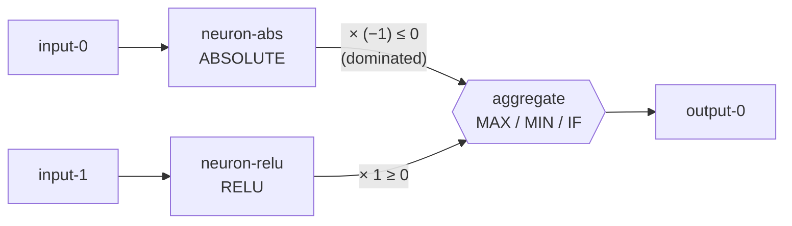

# dominated-branch collapse fixtures (Issue #1705)

Hermetic test fixtures for the #1704 characterisation effort (TDD:
dominated-branch collapse and contribution logic through MAX/MIN/IF). They are
committed here so the collapse-characterisation and contribution-propagation
suites (#1706–#1708) are reproducible **offline** and never reach out to another
repository at runtime.

**Fixtures only — no engine behaviour changes.** This task commits the data the
sibling suites assert against; it does not alter any estimator or aggregate
logic.

## Provenance

Every file here is **hand-authored and synthetic** — this public repository is
fully self-contained, so no fixture is captured from, or derived from, any other
repository (Issue #1722). The networks reproduce the worked-example *shape* (a
selection aggregate fed by two branches, one analytically dominated) and the
cache records reproduce the candidate-cache *shape*; all values are hand-authored,
not copied from a specific creature or cache entry.

One manifest row exists per committed fixture file (asserted by
`tests/collapse_fixtures.rs::fixtures_load_offline`).

| File | Source | Purpose |
|------|--------|---------|
| `networks/maximum_aggregate.json` | Synthetic (worked-example shape) | MAXIMUM selection aggregate fed by two branches; the ABSOLUTE×(−1) branch (always ≤ 0) is analytically dominated because a MAXIMUM never selects it while the RELU branch (always ≥ 0) is present. |
| `networks/minimum_aggregate.json` | Synthetic (worked-example shape) | MINIMUM selection aggregate; here the RELU branch (always ≥ 0) is the dominated one, since a MINIMUM never selects it while the ABSOLUTE×(−1) branch (always ≤ 0) is present. |
| `networks/if_aggregate.json` | Synthetic (worked-example shape) | IF selection aggregate with an explicit **condition** synapse (`type=condition`) plus `positive` (RELU) and `negative` (ABSOLUTE×(−1)) branches; the negative branch is dominated whenever the condition selects positive. |
| `candidate_cache/v2_change-squash_selu-to-absolute.json` | Synthetic (candidate-cache shape) | Candidate-cache-shaped `change-squash` record (SELU→ABSOLUTE): predicted `expectedErrorReduction = +3.0e-10` versus outcome `actualErrorReduction = −6.0e-4`. Captures the placeholder-vs-outcome gap (sign flip plus a >1e5 magnitude gap) the contribution suite grades against. |
| `candidate_cache/d1ac1f41.json` | Synthetic (candidate-cache shape) | 1 success (remove-neuron) versus 5 failures (1 change-squash, 4 remove-neuron). Mirrors a cache directory's success/failure split and change-type mix. |

## Fixture shape

For the IF fixture a third input drives a `neuron-cond` (TANH) neuron wired into
the aggregate through a `condition` synapse; the RELU and ABSOLUTE branches are
the `positive` and `negative` branches respectively.

## Maintenance

Do **not** edit these fixtures by hand to make a downstream test pass. If a
record's shape needs to change, update it deliberately and re-validate
`tests/collapse_fixtures.rs`. The smoke test pins the key values
(`expectedErrorReduction = +3.0e-10`, `actualErrorReduction = −6.0e-4`, and the
`d1ac1f41` 1-success/5-failure split), so silent drift turns CI red.
