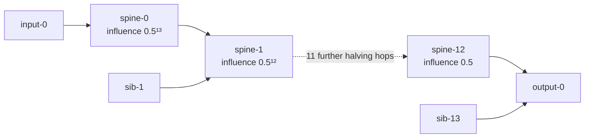

# remove-neuron propagation fixtures (Issue #1517, re-based by Issue #1722)

Hermetic fixtures for `tests/remove_neuron_propagation.rs`. Every file here is
**hand-authored and synthetic** — this public repository is fully self-contained,
so no fixture is captured from, or derived from, any other repository. The tests
load them from disk and never reach out over the network.

| File | Source | Purpose |
|------|--------|---------|
| `network.json` | Synthetic (deep-chain shape) | A 13-hop IDENTITY spine (`spine-0` … `spine-12`) reaching `output-0`. At every hop the spine merges with a sibling branch fed from its own input, so each hop halves the spine's share of the downstream weight budget. The propagation-aware influence of `spine-k` is therefore exactly `0.5^(13−k)` — production-depth attenuation with an analytically derivable value. |
| `v2_remove-neuron_spine-0.json` | Synthetic (candidate-record shape) | A remove-neuron candidate on the deepest spine neuron. Carries the retired placeholder gain (`expectedCreatureScoreGain = +0.18`) and the closed-form propagated effect (`analyticErrorReduction = −1.220703125e-4`). |

## Fixture shape

## Why these values matter

The placeholder gain is ~1,474× larger than — and opposite in sign to — the
analytic propagated effect. The propagation-aware estimator
(`estimate_remove_neuron_gain`, Issue #1518) attenuates the target neuron's
contribution through downstream weights and squash bounds to the output; its
signed estimate is a small negative value that must equal the analytic reference.

Both reference values are **derivable by hand**, so the fixture is a genuine
oracle rather than a recording of whatever the implementation happened to emit:

- `expectedCreatureScoreGain` is exactly what the retired NEAT-AI `#2483`
  topology-blind placeholder `0.1 + (log10(err) − 10)/10 × 0.4` (clamped to
  `[0.1, 0.5]`) emits for `errorMagnitude = 1e12`.
- `analyticErrorReduction` is `−0.5¹³` — the spine neuron's exact share of the
  output's weight budget after 13 halving hops.

All weights are `1` and all squashes `IDENTITY`, so both quantities are exact in
`f32` and the tests assert equality rather than a loose tolerance.

See Issue #1516 for the root-cause analysis and #1518 for the estimator.

Do not edit these fixtures by hand to make a downstream test pass. If the
topology changes, recompute the analytic references from the halving-hop count
and re-validate `placeholder_gain_is_wrong_at_depth`.
