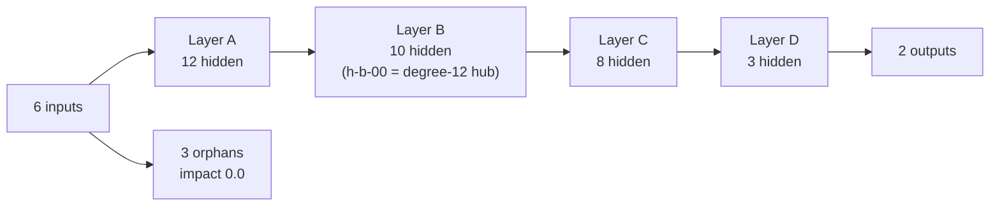

# remove-neuron reachability fixture (Issue #1810)

Hermetic fixture for `tests/issue_1785_remove_neuron_reachability.rs`. It is
**hand-authored and synthetic** — this public repository is fully self-contained,
so no fixture is captured from, or derived from, any other repository.

| File | Source | Purpose |
|------|--------|---------|
| `network.json` | Synthetic (layered production shape) | 6 inputs, **36 hidden** neurons, 2 outputs, 102 synapses. Drives both remove-neuron gates from one creature: the analysis-path honest gain (#1530) and the focus-path structural triage (#1767). |

## Construction rule

The topology is generated by a fixed rule, so every number the characterisation
test prints is re-derivable from the shape alone:

- **6 inputs** `in-0` … `in-5`.
- **Layer A** — `h-a-00` … `h-a-11` (12 neurons), each fed by inputs `i mod 6`
  and `(i+1) mod 6`.
- **Layer B** — `h-b-00` … `h-b-09` (10 neurons), each fed by three layer-A
  neurons.
- **Layer C** — `h-c-00` … `h-c-07` (8 neurons), each fed by three layer-B
  neurons.
- **Layer D** — `h-d-00` … `h-d-02` (3 neurons), each fed by three layer-C
  neurons, each feeding an output.
- **Orphans** — `h-x-0` … `h-x-2` (3 neurons) fed by two inputs each and feeding
  nothing. Their structural impact is exactly `0.0`, which is the only way a
  hidden neuron reaches the noise-floor gate on the focus path.
- **Hub** — `h-b-00` carries 6 incoming and 6 outgoing synapses. Its total degree
  of **12** is the fixture's maximum, so the best boosted removal savings anywhere
  in the creature are exactly `1.5 × 1e-7 × (1 + 12/10) = 3.3e-7` — the value
  #1785 quotes.

Every weight is `1.0` and every squash `IDENTITY`, so a neuron's structural
impact is a pure function of the topology. Neurons are ordered inputs → layers →
orphans → outputs, so every synapse points forward (Issue #1184).

## Why these values matter

The fixture is sized so both gates are genuinely exercised and neither passes
vacuously:

- 36 hidden neurons ⇒ 36 sole-op `RemoveNeuron` candidates on the analysis path.
- 33 connected hidden neurons carry a structural impact far above their boosted
  savings, so they hit the **uncounted** `boosted_savings <= contribution` drop.
- 3 orphans carry impact `0.0`, so they reach — and are rejected by — the
  `REMOVE_LOW_IMPACT_NOISE_FLOOR` gate, which is the counted path.

The measured reference table lives in
[`docs/analysis/remove-neuron-reachability-1785.md`](../../../docs/analysis/remove-neuron-reachability-1785.md).

Do not edit this fixture by hand to make a downstream test pass. If the topology
changes, regenerate it from the rule above and update both the test's pinned
numbers and the reference table.
